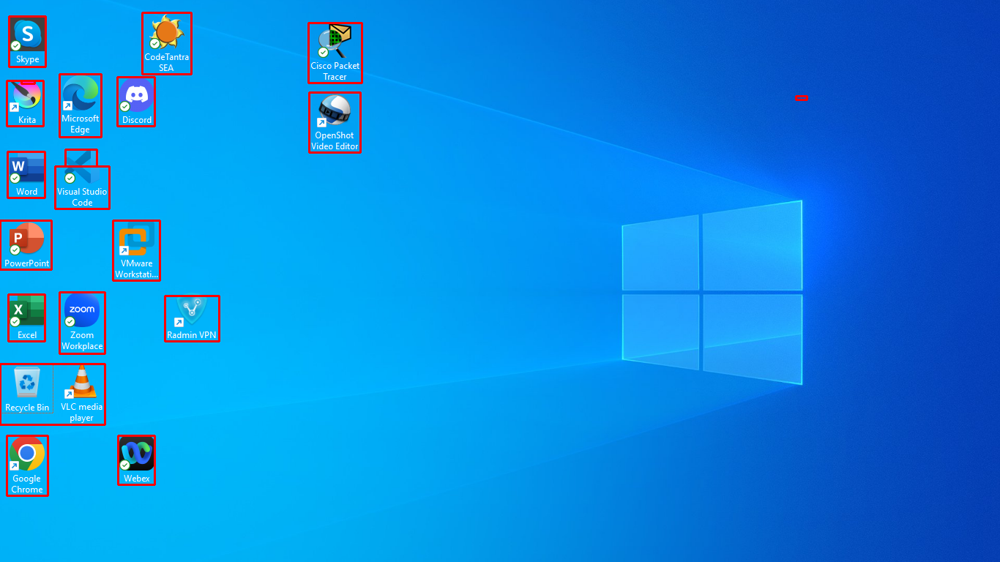

# UI Elements Detection with OpenCV

This project is a look back at my early explorations and experimentation using computer vision for UI element detection and AI Agents. The goal was to identify and isolate UI elements on the screen using raw image processing techniques with OpenCV. While it's not the most effective method, it was a great learning experience in the fundamentals of image processing.

This repository is an archive of that learning process. It demonstrates a foundational approach to a complex problem and shows that image processing might not be reliable for this problem as I later found a more reliable way to fetch elements on the current screen using Windows API for my AI Agent project.

---
## What It Does

This script takes a screenshot of the screen and attempts to identify distinct UI elements like buttons, icons, and text boxes. It then draws bounding boxes around these detected elements and saves them as individual image files.

The core of this project lies in a series of image processing steps designed to distinguish UI components from the background.

### The Process

**Grayscale Conversion:** The first step is to convert the screenshot from color to grayscale. This simplifies the image and is a common prerequisite for many image processing operations, as it reduces the amount of data that needs to be processed.

**Edge Detection:** To find the boundaries of UI elements, the script uses Canny edge detection. This popular algorithm identifies sharp changes in intensity, which often correspond to the edges of buttons, windows, and other components.

**Morphological Operations:** After edge detection, the image can be noisy, with many broken or disjointed edges. To clean this up and make the element shapes more solid, a morphological operation called closing is applied. This technique helps to close small gaps in the detected edges, effectively joining broken lines and making the outlines of UI elements more complete.

**Contour Finding:** With cleaner outlines, the script then finds the contours of the shapes in the processed image. Contours are essentially the outlines of the detected objects.

**Filtering:** Not all contours correspond to actual UI elements. Some might be small specks of noise, while others might be the entire window. To narrow down the results, the contours are filtered based on their area. A minimum and maximum area are set to discard elements that are too small or too large to be considered meaningful UI components.

**UI Automation with pywinauto:** In addition to image processing, this project also experimented with `pywinauto` to gather more structured information about the UI elements. This part of the code interacts with the Windows UI Automation API to get properties of the elements, such as their type (button, checkbox, etc.) and name. This hybrid approach aimed to combine the visual detection of OpenCV with the semantic understanding from `pywinauto`.

The final output is to detect and draw red bounding boxes drawn around the regions that the script identified as potential UI elements. While this method can sometimes successfully identify well-defined UI components, its effectiveness is limited. Modern UIs are often complex and visually dynamic, making a purely image-based approach unreliable. This project was a valuable lesson in the limitations of raw image processing for a nuanced task like UI understanding.

---
## Libraries and Frameworks Used

This project leverages several key Python libraries to achieve its functionality:

* **OpenCV:** The backbone of the image analysis. It's used for all the core computer vision tasks, including converting images to grayscale, performing Canny edge detection, applying morphological transformations, and finding contours.
* **Pillow:** Used for opening image files and handling image data, preparing it for use with other libraries like NumPy and OpenCV.
* **NumPy:** Essential for numerical operations. It efficiently handles the image data, which is represented as multi-dimensional arrays.
* **PyAutoGUI:** This library bridges the gap between detection and interaction. After OpenCV identifies and saves an element as an image, PyAutoGUI is used to locate that image on the screen and programmatically control the mouse to move to and click on the element's coordinates.
* **pywinauto:** Used for deeper integration with the Windows operating system. It allows the script to query the properties of UI elements directly through the UI Automation (UIA) backend, providing details like element names, types, and visibility state.
* **Keyboard:** A simple but effective library for controlling the script's execution. It's used here to pause the script and wait for a specific key press before proceeding, giving the user control over the process.
* **ctypes:** A standard Python library used to call functions in shared libraries/DLLs. In this project, it's used to interact with the Windows API to get the system's screen resolution.
